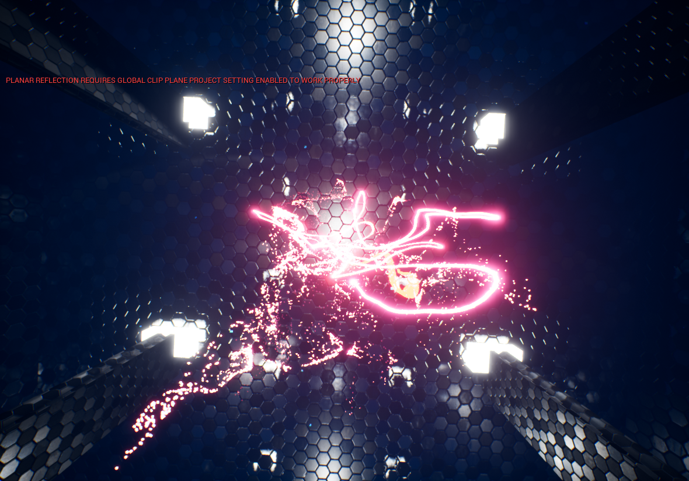

[![MIT License][license-shield]][license-url]
[![LinkedIn][linkedin-shield]][linkedin-url]

<!-- PROJECT LOGO -->

 
 

  
  
  <h3 align="center">FPS-MULTIPLAYER-PROJECT-WINDOWS64-32BIT-</h3>

  

Ue4 VFX Niaagra plasma effect
   

<!-- ABOUT THE REPO -->
## About The vfx

Unreal Engine Effect glowing particles
that can allign in given shapes.
Effect is using module script for Tri cordinates of given shape

### Technology, built with

* [Unreal Engine 4.24]
* [Unreal Engine Niaagra VFX]

### Scnreenshot

<!-- ROADMAP -->
## Side Game Mode Mechanics

### Hitmark System
* [Deathmatch]headshot-[100]hp
* [Deathmatch]upper body-[65-75]hp
* [Deathmatch]torso-[50-60]hp
* [Deathmatch]arms/legs-[25-30]hp
* [Deathmatch]foot/fingers-[10-15]hp

## Team
*Paweł Brzóska - Programming/Testing
*Maciej Adamczak - Game Design/Level Designer/

<!-- Summary -->
## Sumary

* [Map rebuild, testing]

## Mentions
*Michał Tessar - GAME TESTER -
*Maciej Choromański - GAME TESTER - https://github.com/MaciejChoromanski

## Contact

*Paweł Brzóska
*Email - pbrzoska024@gmail.com
*Facebook - https://www.facebook.com/profile.php?id=100002540185841

*Project Link: [https://github.com/pbrzoska024/FPS-MULTIPLAYER-PROJECT-WINDOWS64-32BIT-](https://github.com/pbrzoska024/FPS-MULTIPLAYER-PROJECT-WINDOWS64-32BIT-)

<!-- LICENSE -->
## License

Distributed under the MIT License. See `LICENSE` for more information.

<!-- MARKDOWN LINKS & IMAGES -->
<!-- https://www.markdownguide.org/basic-syntax/#reference-style-links -->
[issues-url]: https://github.com/othneildrew/Best-README-Template/issues
[license-shield]: https://img.shields.io/github/license/othneildrew/Best-README-Template.svg?style=flat-square
[license-url]: https://github.com/othneildrew/Best-README-Template/blob/master/LICENSE.txt
[linkedin-shield]: https://img.shields.io/badge/-LinkedIn-black.svg?style=flat-square&logo=linkedin&colorB=555
[linkedin-url]: https://www.linkedin.com/in/paweł-brzóska-522634179/
[product-screenshot]: images/screenshot.png

### VFX in environment ###

https://www.youtube.com/watch?v=YMb1aizq9CA

